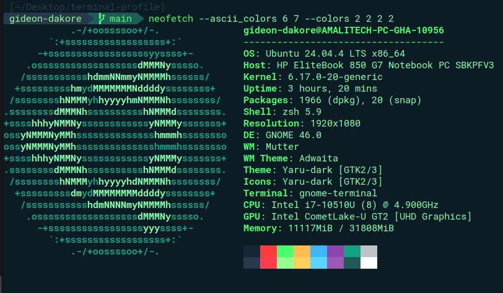

# Terminal Profile



This is my profile for UNIX (MacOS/Linux) terminals. For Ubuntu, I just use the default terminal
app. For MacOS, I use [iTerm2](https://iterm2.com/).

> In the MacOS case, I have successfully installed this theme once before, but most of the terminal commands
> will be different. You'll just have to open the `.sh` files and figure out how to adapt it to MacOS
> until I can prepare MacOS commands.

These commands were last tested on April 2026 on Ubuntu 24.

# Prerequisites

For the scripts to work, I think these are the bare minimum requirements.

```bash
# Update your software repositories.
sudo apt update
sudo apt upgrade

# Install Git.
sudo apt install -y git

# Install Vim.
sudo apt install -y vim

# Install Python3 and pip.
sudo apt install -y python3 python3-pip
```

# Installation

### 1. Set Up Virtual Environment

First, create and activate a Python virtual environment to isolate the installation:

```bash
# Create the virtual environment
# Use python3 if you have both Python 2 and Python 3 installed
python3 -m venv terminal-profile

# Or if your system only has Python 3 installed, you can use
python -m venv terminal-profile

# Navigate into the project directory
cd terminal-profile

# Activate the virtual environment
source bin/activate
```

> You can check which version of Python your system is using by running:
>
> ```bash
> python --version
> python3 --version
> ```
>
> Make sure it is Python 3.x before proceeding. Python 2 is no longer supported.

> You should see `(terminal-profile)` appear at the start of your terminal prompt, confirming
> the virtual environment is active. Sometimes `(terminal-profile)` may not appear in the prompt.
> Make sure the `source bin/activate` command completed successfully before proceeding.

> **Note:** All scripts must be run from within the activated virtual environment. If you open
> a new terminal session, you will need to activate it again with `source bin/activate`.

### 2. Clone the Repository

```bash
git clone https://github.com/gideondakore/terminal-profile.git .
```

### 3. Run the Installer

Run the single install script to set up everything at once:

```bash
./install.sh
```

> This will run `install_powerline.sh`, `install_terminal.sh`, and `install_profile.sh` in order.

After the script completes, reload your shell configuration:

```bash
source ~/.zshrc
```

> **Note:** You must run `source ~/.zshrc` manually after the script finishes.
> It cannot be done automatically inside the script.

If it looks funky after this command, then you might need to wait until the theme is updated with a
Powerline font, and may need to also restart your machine.

## Notes

How to dump current terminal profiles.

```bash
dconf dump /org/gnome/terminal/legacy/profiles:/ > gnome-terminal-profiles.dconf
```

How to display terminal information (I use [Neofetch](https://github.com/dylanaraps/neofetch)).

```bash
sudo apt install neofetch

# Display the profile
# I override the colors because the default red is kinda ugly in this theme.
neofetch --ascii_colors 6 7 --colors 2 2 2 2
```

## How do I reset the changes back to the old terminal?

There's two main modifications being done to the terminal. The terminal theme, and the shell itself.

For the theme, here's a thread I found on the internet on how to reset it to the default: https://askubuntu.com/questions/14487/how-to-reset-the-terminal-properties-and-preferences

For the terminal shell itself, we actually installed a new terminal (zsh) alongside the default bash. Bash itself wasn't removed, but we just set the default shell to `zsh`. Here is a thread on how to uninstall zsh and default back to bash: https://askubuntu.com/questions/958120/remove-zsh-from-ubuntu-16-04

To switch back to bash manually:

```bash
chsh -s /bin/bash
```

Then log out and back in for the change to take effect.

## Deactivating the Virtual Environment

When you are done, you can deactivate the virtual environment by running:

```bash
deactivate
```

> **Note:** The `deactivate` command only works when the virtual environment is active.
> If you see `command not found: deactivate`, run `source bin/activate` first.

## Sources

Here are some of the main resources I used as part of this terminal setup.

[Oh My Zsh!](https://medium.com/wearetheledger/oh-my-zsh-made-for-cli-lovers-installation-guide-3131ca5491fb) | [Robby Russel OMZ](https://github.com/robbyrussell/oh-my-zsh) | [Install Powerline](https://askubuntu.com/questions/283908/how-can-i-install-and-use-powerline-plugin) | [Powerline Patched Fonts](https://github.com/powerline/fonts) | [Agnoster Theme](https://gist.github.com/3712874)
